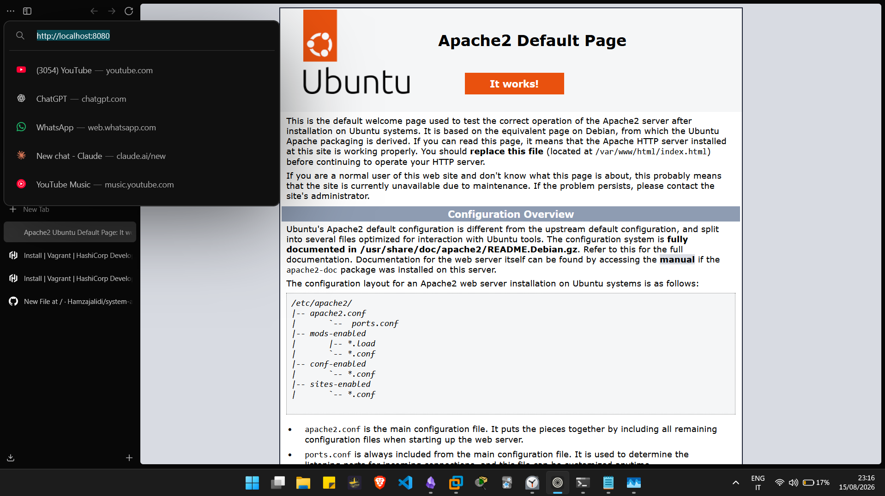
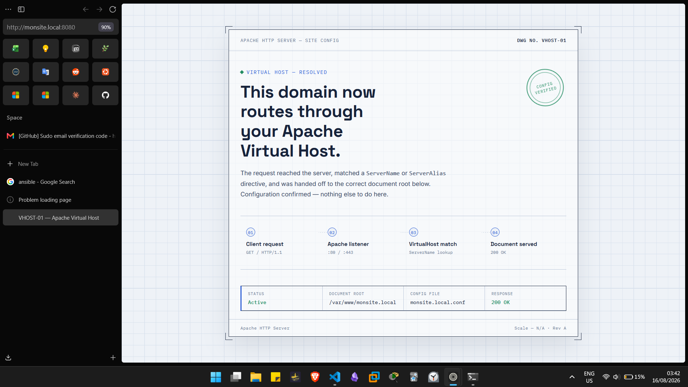
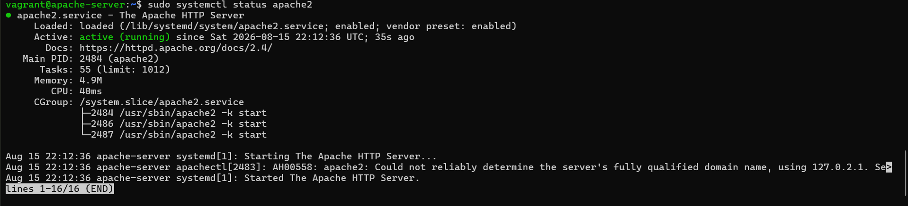
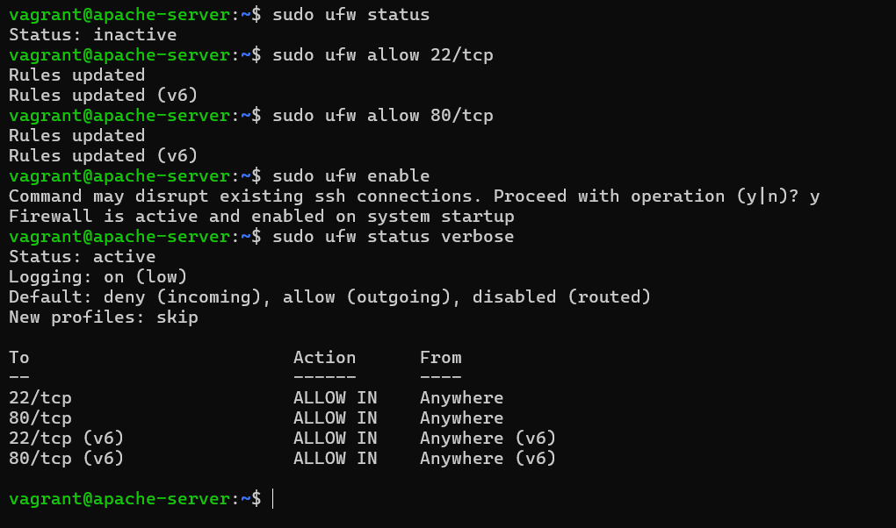

<h1 align="center">🌐 Lab 01 — Apache Web Server</h1>

<p align="center">
  Virtual Apache2 server with custom VirtualHost, UFW Firewall & Vagrant automation.<br>
  <em>From zero to a working web server in minutes.</em>
</p>

<p align="center">
  
  
  
  
  
  
</p>

<p align="center">
  <a href="#-quick-start-vagrant"></a>
  <a href="#-verification"></a>
  <a href="#-troubleshooting"></a>
</p>

---

## 📑 Table of Contents

- [Overview](#-overview)
- [Architecture](#-architecture)
- [Prerequisites](#-prerequisites)
- [Quick Start (Vagrant)](#-quick-start-vagrant)
- [Manual Setup](#-manual-setup)
- [Project Structure](#-project-structure)
- [Verification](#-verification)
- [Challenges Faced](#-challenges-faced)
- [Troubleshooting](#-troubleshooting)
- [Lessons Learned](#-lessons-learned)

---

## 🔭 Overview

This lab provisions a fully configured Apache2 web server on Ubuntu 22.04 using Vagrant. It demonstrates:

| Feature | Description |
|---------|-------------|
| **Apache2** | Web server with custom VirtualHost |
| **VirtualHost** | Hosts `monsite.local` on a dedicated document root |
| **UFW Firewall** | Port 80 open, SSH protected |
| **Port Forwarding** | Access from host via `localhost:8080` |
| **Infrastructure as Code** | Entire environment defined in `Vagrantfile` |

### 🧠 Skills Demonstrated

`Linux Administration` · `Apache Configuration` · `VirtualHost Setup` · `Firewall Management (UFW)` · `Vagrant Provisioning` · `Infrastructure as Code` · `DNS / hosts File Configuration` · `Systemd Service Management`

---

## 🏗️ Architecture

```
┌─────────────────┐      Port 8080       ┌──────────────────┐      Port 80         ┌─────────────────┐
│   Host (Windows)│  ═══════════════════►│ VM (Ubuntu 22.04)│  ═══════════════════►│   Apache2       │
│                 │                      │                  │                      │   Web Server    │
│  monsite.local  │◄─────────────────────│  192.168.56.10   │◄─────────────────────│   monsite.local │
│  127.0.0.1      │   hosts file         │  NAT + Private   │   VirtualHost        │   DocumentRoot  │
└─────────────────┘                      └──────────────────┘                      └─────────────────┘
```

**Data Flow:**
1. Browser requests `http://monsite.local:8080`
2. Vagrant forwards port 8080 → 80 on the VM
3. Apache matches `ServerName monsite.local`
4. Serves content from `/var/www/monsite.local`

---

## ⚙️ Prerequisites

| Tool | Version | Purpose |
|------|---------|---------|
| [VMware Workstation](https://www.vmware.com/products/workstation-player.html) | Latest | Virtualization |
| [Vagrant](https://www.vagrantup.com/) | 2.4.9+ | VM orchestration |
| [Vagrant VMware Utility](https://developer.hashicorp.com/vagrant/docs/providers/vmware/vagrant-vmware-utility) | Latest | VMware provider support |

```bash
# Install VMware plugin
vagrant plugin install vagrant-vmware-desktop
```

---

## 🚀 Quick Start (Vagrant)

```bash
# 1. Clone and enter the project
git clone https://github.com/Hamzajalidi/system-administration-labs.git
cd system-administration-labs/apache-project

# 2. Start the virtual machine
vagrant up --provider=vmware_desktop

# 3. SSH into the server
vagrant ssh
```

Then open your browser:
```
http://localhost:8080
```

### Useful Vagrant Commands

| Command | Action |
|---------|--------|
| `vagrant up` | Start the VM |
| `vagrant ssh` | SSH into the VM |
| `vagrant halt` | Stop the VM |
| `vagrant destroy` | Delete the VM |
| `vagrant reload` | Restart with re-provisioning |

---

## 🛠️ Manual Setup

If you prefer to learn step-by-step without Vagrant:

### 1. Update system & install Apache
```bash
sudo apt update
sudo apt install -y apache2
```

### 2. Configure UFW Firewall
```bash
sudo ufw allow 22/tcp   # Protect SSH FIRST
sudo ufw allow 80/tcp   # Open HTTP
sudo ufw enable
```

### 3. Create document root
```bash
sudo mkdir -p /var/www/monsite.local
sudo cp html/index.html /var/www/monsite.local/
sudo chown -R www-data:www-data /var/www/monsite.local
```

### 4. Enable VirtualHost
```bash
sudo cp config/vhost.conf /etc/apache2/sites-available/monsite.local.conf
sudo a2ensite monsite.local.conf
sudo a2dissite 000-default.conf
sudo systemctl reload apache2
```

### 5. Edit hosts file (on Windows)
Add to `C:\Windows\System32\drivers\etc\hosts`:
```
127.0.0.1    monsite.local
```

### 📄 VirtualHost Configuration (`config/vhost.conf`)

```apacheconf
<VirtualHost *:80>
    ServerName monsite.local
    ServerAlias www.monsite.local
    DocumentRoot /var/www/monsite.local

    <Directory /var/www/monsite.local>
        Options Indexes FollowSymLinks
        AllowOverride All
        Require all granted
    </Directory>

    ErrorLog ${APACHE_LOG_DIR}/monsite_error.log
    CustomLog ${APACHE_LOG_DIR}/monsite_access.log combined
</VirtualHost>
```

---

## 📁 Project Structure

```
apache-project/
├── 📂 config/
│   └── vhost.conf              # Apache VirtualHost configuration
├── 📂 html/
│   └── index.html              # Custom web page served by Apache
├── 📂 scripts/
│   └── setup.sh                # Automated provisioning script
├── 📂 screenshots/             # Step-by-step proof of work
│   ├── 01-virtualhost-page.png
│   ├── 02-ufw-status.png
│   └── 03-apache-status.png
├── 📄 Vagrantfile              # VM definition & provisioning
├── 📄 README.md                # This file
└── 📄 LICENSE                  # MIT License
```

---

## ✅ Verification

> 📁 **For the full gallery** (Vagrant install, VM setup, log files, etc.)
> See the [`screenshots/`](screenshots/) directory.

### Result Summary

| Check | Status | Evidence |
|-------|--------|----------|
| Apache2 Service | ✅ Active | `systemctl status apache2` |
| VirtualHost Config | ✅ Loaded | `monsite.local.conf` |
| UFW Firewall | ✅ Active | Ports 22 & 80 open |
| Web Access | ✅ 200 OK | `http://monsite.local:8080` |

### Screenshots
<table> <tr> <td align="center" width="50%"> <b>Apache Default Page</b><br><br>  </td> <td align="center" width="50%"> <b>Custom VirtualHost (<code>monsite.local</code>)</b><br><br>  </td> </tr> <tr><td colspan="2">&nbsp;</td></tr> <tr> <td align="center" width="50%"> <b>Apache Service Status</b><br><br>  </td> <td align="center" width="50%"> <b>UFW Firewall Active</b><br><br>  </td> </tr> </table>
---

## 🔥 Challenges Faced

> **Problem:** After enabling UFW firewall, I lost SSH access to the VM.
>
> **Root Cause:** UFW blocks all incoming ports by default, including SSH (port 22).
>
> **Solution:** Always allow SSH **before** enabling UFW:
> ```bash
> sudo ufw allow 22/tcp   # Do this FIRST
> sudo ufw allow 80/tcp
> sudo ufw enable
> ```
>
> **Lesson:** In production, locking yourself out of a remote server means physical access or rescue mode is required. Order of operations matters in firewall configuration.

---

## 🔧 Troubleshooting

| ⚠️ Issue | ✅ Solution |
|----------|-------------|
| `localhost:8080` not loading | Ensure VM is running: `vagrant up` |
| `monsite.local` not resolving | Add `127.0.0.1 monsite.local` to your hosts file |
| UFW blocks SSH | Always run `ufw allow 22/tcp` **before** `ufw enable` |
| Apache fails to start | Run `sudo apachectl configtest` to check syntax |
| 403 Forbidden on VirtualHost | Check folder permissions: `sudo chown -R www-data:www-data /var/www/monsite.local` |
| Changes not reflecting | Restart Apache: `sudo systemctl restart apache2` |

---

## 🎓 Lessons Learned

> **Lesson 1:** Always open SSH (port 22) in UFW **before** enabling the firewall, or you will lock yourself out.

> **Lesson 2:** Apache VirtualHost allows hosting multiple websites on a single server using different domain names and document roots.

> **Lesson 3:** Vagrant turns a virtual environment into code — reproducible, versionable, and shareable. This is the foundation of Infrastructure as Code (IaC).

> **Lesson 4:** The `hosts` file is a local DNS resolver. It maps domain names to IP addresses without needing a real DNS server.

---

## 🔗 Main Repository

📂 [system-administration-labs](https://github.com/Hamzajalidi/system-administration-labs)

---

<p align="center">
  Built with ❤️ for hands-on System Administration learning.<br>
</p>

